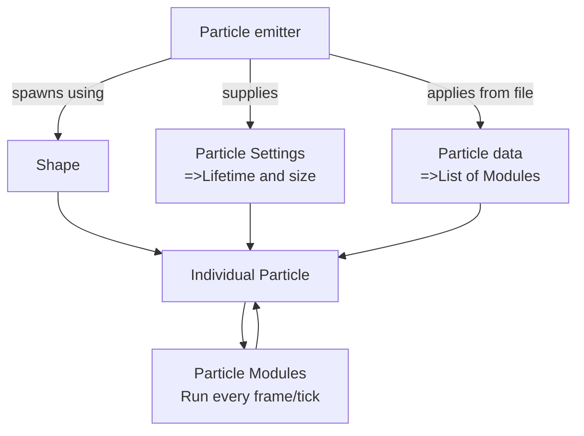

# Quasar(Veil) Cheatsheet

# **I do not take any guarantee for the Informations provided here since they can change any day depending on Veil.**

This document is supposed to give you a quick overview over the various files you need to compose Particles with Veil and Quasar, it‘s Particle system.

**A bit of terminology:**

[Veil](https://github.com/foundryMC/veil) is a Minecraft mod developed by [FoundryMC](https://github.com/foundryMC)

Quasar is their Particle system built into the mod.

**Codecs:**

Quasar uses so-called Codecs to read it‘s particles from Resource Packs. If you are not familiar with what a codec is, read it up [here](https://gist.github.com/Drullkus/1bca3f2d7f048b1fe03be97c28f87910) or [h](https://gist.github.com/Drullkus/1bca3f2d7f048b1fe03be97c28f87910#quick-crash-course-with-codecs)[ere](https://fabric.moddedmc.wiki/misc-topics/codecs).

When you don‘t know what a entry should look like, search it up on Veil‘s Github or, if it is a Minecraft Codec, using [linkie](https://linkie.shedaniel.dev/mappings?namespace=mojang_raw&version=1.20.1&search=&translateMode=none)

All relative paths go off of assets/<mod_id>/quasar/.

| File | Relative Path | Function | Required? | Link to Specification |
| --- | --- | --- | --- | --- |
| Particle Emitter | emitters | Defines all informations of spawning this particle | ✅ | [Github](https://github.com/FoundryMC/Veil/blob/a24b70de8c44775da20b0d51df56b601691f8ce8/Common/src/main/java/foundry/veil/api/quasar/data/ParticleEmitterData.java#L27) |
| EmitterSettings | Part of Particle Emitter file | Links emission shape and particle settings | ✅ | [Github](https://github.com/FoundryMC/Veil/blob/a24b70de8c44775da20b0d51df56b601691f8ce8/Common/src/main/java/foundry/veil/api/quasar/data/EmitterSettings.java#L11) |
| Particle Shape | modules/emitter/particle/shape | Defines where relative to the emitter to spawn particles | ❌ | [Github](https://github.com/FoundryMC/Veil/tree/1.20/Common/src/main/java/foundry/veil/api/quasar/emitters/shape) |
| Particle settings | modules/emitter/particle | Defines a few properties like size and lifetime for each particle | ❌ | [Github](https://github.com/FoundryMC/Veil/blob/a24b70de8c44775da20b0d51df56b601691f8ce8/Common/src/main/java/foundry/veil/api/quasar/data/ParticleSettings.java#L26) |
| Particle Data | modules/particle_data | Defines the modules for this particle | ❌ | [Github](https://github.com/FoundryMC/Veil/blob/36e50a54ac924ddeae4caf650c767e7c1175f10f/Common/src/main/java/foundry/veil/api/quasar/data/QuasarParticleData.java#L52) |
| Modules | modules/ | Control the particles behavior while existing | ❌ | [Github](https://github.com/FoundryMC/Veil/tree/36e50a54ac924ddeae4caf650c767e7c1175f10f/Common/src/main/java/foundry/veil/api/quasar/data/module) |

For further examples see the [example Resource pack for Particles.](https://github.com/FoundryMC/Veil/tree/1.20/Common/src/main/resources/resourcepacks/test_particles/assets/veil/quasar)

### Particle Emitter

A particle emitter is, as the name implies, a point in Space that spawns Particles. It defines some additional data about itself and the data the spawned Particle(s) will consist of.

### Particle Emitter Shape

When multiple particles are spawned from the Emitter, it defines the shape in which to spawn them. [See the Github for a list of available ones](https://github.com/FoundryMC/Veil/tree/1.20/Common/src/main/java/foundry/veil/api/quasar/emitters/shape). Every Emitter has a Vec3f (aka: a list of three decimal numbers) for its size and rotation.

### Particle Data

The Particle Data defines a list of Particle Modules that should be attached to this Particle when spawned. 

### Particle Modules

A module can do various things when applied to a particle, for example make it have Physics or render a trail behind it. In fact, you have already written modules when you made it this far: The Particle emitter settings and it‘s data are nothing more than mandatory Particle modules

[List of all particle modules](https://github.com/FoundryMC/Veil/tree/1.20/Common/src/main/java/foundry/veil/api/quasar/data/module)

There are the following base types of Modules on which all other modules are based on:

- [Update modules](https://github.com/FoundryMC/Veil/tree/1.20/Common/src/main/java/foundry/veil/api/quasar/data/module/update)
- [Render Modules](https://github.com/FoundryMC/Veil/tree/1.20/Common/src/main/java/foundry/veil/api/quasar/data/module/render)
- [Init Modules](https://github.com/FoundryMC/Veil/tree/1.20/Common/src/main/java/foundry/veil/api/quasar/data/module/init)

Additionally to these base modules, there are also [Force](https://github.com/FoundryMC/Veil/tree/1.20/Common/src/main/java/foundry/veil/api/quasar/data/module/force) and [Collision](https://github.com/FoundryMC/Veil/tree/1.20/Common/src/main/java/foundry/veil/api/quasar/data/module/collision) Modules which are shipped with Veil.

These modules are ran, depending on the module, while the particle exists or when it is spawned. A rendering module will be ran every frame, whereas init modules will, as the name implies, only run when the Particle is initialized, Update modules when it is ticked

When using them, you create a new instance of this module with the arguments you give it. Please keep in mind each Module can have it‘s own arguments, for example the Trail Module allows you to define the color, width and texture of it.
